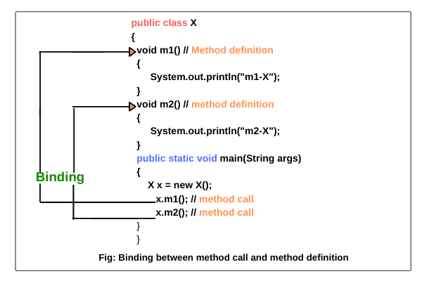

# Contextos estático y dinamico:
En el desarrollo de un programa en Java, existen los tiempos de compilación y ejecución. En ambos tiempos se crean enlaces (binding) que determinan el tipo de los objetos.



## Contexto estático
Los miembros estáticos (miembros como métodos y variables) usan enlaces estáticos o tempranos que se resuelven en tiempo de compilación. Es decir, el compilador sabe exactamente que método llamar cuando hay polimorfismo o herencia.

```
private
final
static
```

## Contexto dinámico
Como en el tiempo de ejecución aun no se resuelve el tipo de las variables en el compilador, este se resuelve cuando se ejecuta el programa. Se utiliza el objeto para determinar el tipo. Para sobreescribir un método se utiliza la siguiente anotación.

```
@Override
```

## Extras
- Ver tutorial en [DelftStak](https://www.delftstack.com/es/howto/java/static-and-dynamic-binding-in-java/)
- Ver respuesta en [StackOverflow](https://stackoverflow.com/questions/19017258/static-vs-dynamic-binding-in-java)
