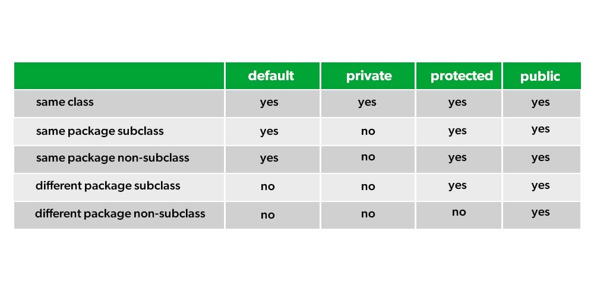

# Modificadores de acceso:
Relacionados al término de encapsulamiento, se refiere a una palabra reservada que se usa para indicar que tan oculto van a estar los atributos y métodos de una clase.

```
public
protected
private
```




## Extras
- Ver tutorial en [W3SCHOOLS](https://www.w3schools.com/java/java_modifiers.asp)
