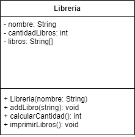

# Ejercicios libreria:

## Enunciado
En base al UML crear el código fuente, el método addLibro, agrega un elemento tipo string a la libreria. Tenga en cuenta que la libreria solo puede guardar máximo 10 libros. El método calcularCantidad, calcula cuantos libros hay en la libreria. El método imprimirLibros, imprime libros en consola arrojando el siguiente resultado como ejemplo:

```
Libros:
Head First Java
El amor en los tiempos del cólera
La divina comedia
```




## Actividades a realizar

1. Cree un proyecto de Bluej o Netbeans.
2. Cree la clase con los métodos necesarios para implementar
3. De acuerdo con los ejercicios presentados en las otras tématicas, realice el UML
de cada una de las clases de cada proyecto


## Extras
- Codigo de prueba (dentro de un método main):
```
Libreria libreria = new Libreria("oreally");
libreria.addLibro("Head First Java");
libreria.addLibro("El amor en los tiempos del cólera");
libreria.addLibro("La divina comedia");
System.out.println("La cantidad de libros es: " + libreria.calcularCantidad());
```