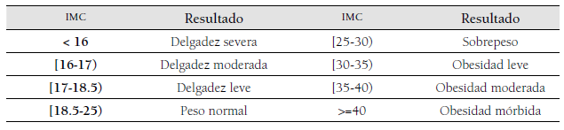

# Ejercicio cálculo de índice de masa corporal:

Se desea desarrollar un programa que calcule el índice de masa corporal de
una persona. Para ello, se requiere definir el peso de la persona (en kilogramos)
y su estatura (en metros). El índice de masa corporal (IMC) se calcula
utilizando la siguiente fórmula:
<br/>

```math
IMC=peso/estatura^2
```
<br/>
Luego, a partir del IMC obtenido se pueden calcular si una persona tiene
un peso normal, inferior o superior al normal u obesidad. Para generar estos
resultados el IMC calculado debe estar en la siguiente tabla:
<br/>

