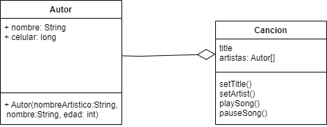
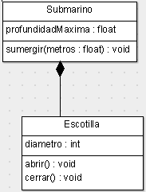

# Composición, asociación y agregación:
En cada proyecto de Java, se permiten relacionar las clases entre sí usando sus métodos o atributos.

## Relación de asociación:
Es cuando una clase se relaciona con otra por medio de un método. La asociación puede ser bidireccional o unidireccional.

### Bidireccional

## Relación de agregación:
Una clase depende de otra según sus atributos.

## Relación de composición:
Al igual que la agregación una clase A depende de otra clase B según sus atributos. En código se ve exactamente igual, sin embargo, indica conceptualmente que si la clase A deja de existir, de igual forma pasa con la clase B. Por ejemplo, tenemos dos clases, un automovil y la clase llanta, si el automovil deja de existir, deberia pasar lo mismo con llanta. Esta lógica se deberia contemplar en el método main donde solo podamos acceder a los miembros de llanta solo por medio de automovil.

