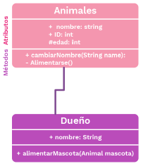

# Composición, asociación y agregación:
En cada proyecto de Java, se permiten relacionar las clases entre sí usando sus métodos o atributos.

## Relación de asociación:
Es cuando una clase se relaciona con otra por medio de un método. La asociación puede ser bidireccional o unidireccional.

### Bidireccional

