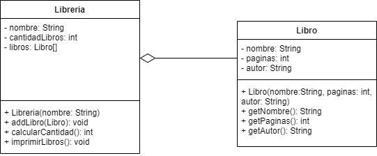

# Ejercicios libreria 2.0:

## Enunciado
En base al UML crear el código fuente.
El método addLibro agrega un elemento tipo Libro al atributo libros. Tenga en cuenta que la libreria solo puede guardar máximo 10 libros. El método calcularCantidad calcula cuantos libros hay en la libreria y le asigna el valor al atributo. El método imprimirLibros, imprime libros en consola arrojando el siguiente resultado como ejemplo:

```
[Libreria Panamericana, 3 libros]:
Título: Head First Java, páginas: 722, autor: Kathy Sierra & Bert Bates
Título: El amor en los tiempos del cólera, páginas: 490, autor: Gabriel Garcia Marquez
Título: La divina comedia, páginas: 274, autor: Dante Alighieri
```



## Actividades a realizar

1. Cree un proyecto de Bluej o Netbeans.
2. Cree las clases basándose en el UML.
3. Realice la lógica de los metodos para que funcionen de acuerdo al enunciado.
4. Cree una clase App que solo tenga un método main.
5. Agregue el código de prueba en el método main.

## Extras
- Codigo de prueba (dentro de un método main):
```
Libreria libreria = new Libreria("Panamericana");
libreria.addLibro("Head First Java",722,"Kathy Sierra & Bert Bates");
libreria.addLibro("El amor en los tiempos del cólera",490,"Gabriel García Marquez");
libreria.addLibro("La divina comedia",274,"Dante Alighieri");
libreria.imprimirLibros();
```