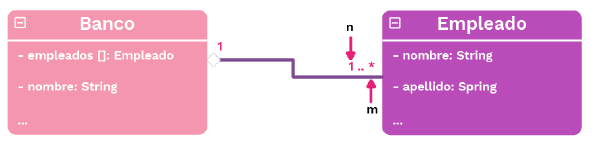

# Cardinalidad:
Cuando existe una relación de asociacion, agregacion y composicion, se determina que la cardinalidad es la asignacion de las cantidades de objetos en una relación.

## Relación de asociación:
Se puede representar por tres formas en el UML:
- n
- n..m
- n..*

Donde, n es el número minimo de objetos, m es el numero maximo de objetos y * es una cantidad infinita de objetos en una relación.

