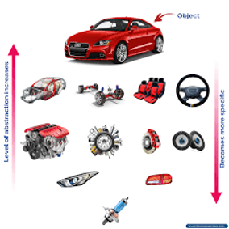

# Ejercicio Automóvil:
Te encuentras trabajando como técnico en un consesionario, el gerente se enteró que realizaste el curso de MisiónTIC 2022 y te pide un software para realizar el inventario de las partes de un automovil. Empiezas a analizar un automovil desde el nivel mas alto de abstracción para finalmente representar en clases el inventario.

## Actividades a desarrollar:
1. Plantea la clase en el nivel más alto de abstracción (Automovil).
2. Empieza a crear más clases a medida que bajes el nivel de abstracción. (Llantas, Puertas, etc.)
3. Crea relaciones entre las clases.
4. Crea el UML resultante, incluye relaciones y cardinalidad.

