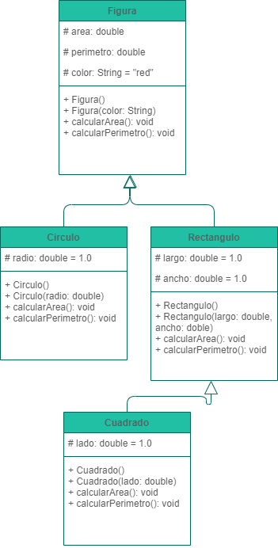

# Ejercicio Figuras:
Estas desarrollando una app movil para hacer calculos basados en figuras geometricas. Vas a implementar clases que te permitan calcular el area y el perimetro de un circulo, un rectangulo y un cuadrado.



## Actividades a desarrollar:
1. Basado en el UML crea las clases que necesitas para el ejercicio.
2. Una vez tengas todo implementado usa el siguiente codigo de prueba para colocar dentro del método main.
```
public static void main(String[] args)
    {
        Circulo circulo = new Circulo(3.5);
        Rectangulo rectangulo = new Rectangulo(7,4);
        Cuadrado cuadrado = new Cuadrado(5);
        
        // Calculos
        circulo.calcularArea();
        rectangulo.calcularArea();
        cuadrado.calcularArea();
        circulo.calcularPerimetro();
        rectangulo.calcularPerimetro();
        cuadrado.calcularPerimetro();
    }
```
3. Ajusta el codigo de prueba anterior para aplicar polimorfismo.
4. ¿Es posible reducir el codigo para llamar los metodos calcularArea() y calcularPerimetro()? Si lo es, realiza el respectivo codigo.

## Tips
- Siempre que veas un codigo repetitivo, en este caso, varias llamadas de metodos para realizar calculos, es posible representar ese codigo en un iterador (for, while, do while)