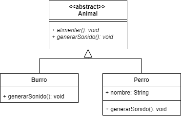

# Clases abstractas:
Son clases que tienen un unico fin, ser heredadas por subclases. Entonces, en pocas palabras podemos decir que, ¿todas las superclases deben ser abstractas?. En algunos casos si, pero, ¿porque razón?. Resulta que las clases abstractas no pueden ser instanciadas (Es decir no podemos crear objetos de estas clases), por una sencilla razon, la clase abstracta representa un objeto abstracto de la vida real.
</br>
Recuerdas el ejemplo de herencia donde teniamos una superclase animal y subclases como: tigre, hipopotamo, gato, perro, león, etc. Si tu creas un objeto de la superclase, es decir, tipo animal, en realidad ¿qué animal representa ese objeto?.

```
Animal indefinido = new Animal();
```

Es abstracto, no tenemos ni la menor idea de que animal deberia representar. Por lo tanto, podemos decir que no se deberia crear instancias de la clase Animal, pero si es una clase para realizar herencia. Entonces marcamos la clase como abstracta.
```
public abstract class Animal{
    void alimentar(){}
    void generarSonido(){}
}
```
Bueno pero..., ¿el resto de miembros de la clase abstracta (métodos y atributos) siguen igual? </br>
Tanto las clases como los métodos *pueden ser abstractos*, un método abstracto se veria de la siguiente forma:
```
public abstract class Animal{
    void alimentar(){}
    public abstract void generarSonido();
}
```
Es decir, es un método sin un cuerpo, sin funcionalidad. Entonces, ¿para que nos sirve un método así? </br>
En el contexto, resulta que todos los animales generan un sonido, sin embargo es diferente, por ejemplo unos animales hacen un maullido, otros rugido, aullido, gruñido, graznido, etc. Entonces, la finalidad de un método abstracto es ser sobreescrito en una o varias subclases. De esta forma las clases más especificas deben sobreescribir siempre el método y se asegura en este caso que todos los animales emitan un sonido.

```
public class Burro{
    void alimentar(){}

    @Override
    public void generarSonido(){
        System.out.println("rebuznar");
    }
}
```
Recordemos que, sin importar si la superclase es abstracta o no, como hay herencia aplica támbien el concepto de polimorfismo.

Un ejemplo de la clase abstracta animal en UML seria:



El método abstracto esta en formato itálica.