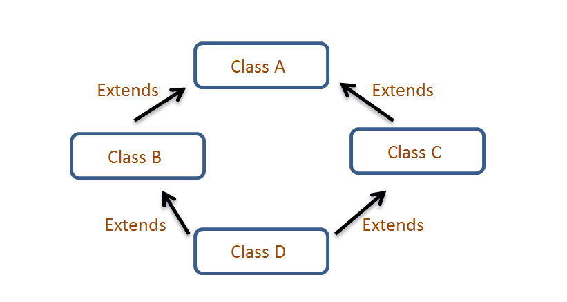

# Interfaces:

Suena a algún elemento gráfico en Java, sin embargo, en este caso no es asi, una interfaz es simplemente una clase 100% abstracta. Entonces, que usamos, clases abstractas o interfaces. Veamos el siguiente ejemplo. </br>
¿Recuerdas el ejemplo de los animales?, resulta que queremos usar ese proyecto para una tienda veterinaria, entonces, supongamos que tenemos la superclase Animal y las subclases, perro, gato, leon y lobo. ¿Es posible crear otra clase Mascota para que sea heredada por perro y gato?, NO!, en Java no se puede hacer multiple herencia debido al problema del diamante.
</br>

</br>
En este caso la clase D al hacer multiple herencia ja recibido dos veces los atributos y metodos de la clase A. </br>
Para solucionar el problema, Java permite implementar las llamadas INTERFACES, en pocas palabras una interfaz tiene solo métodos abstractos de tal forma que las clases que IMPLEMENTEN la interfaz tengan que sobreescribir los métodos.
Entonces en este caso si la interfaz Mascota se define con un solo método asi:

```
public interface Mascota {
    void pasear();
}
```
La clase perro puede implementar la clase Mascota asi:
```
public class Perro extends Animal implements Mascota {
    @Override
    void pasear(){
        System.out.println("Dando un paseo en el parque");
    }
}
```
Teniendo en cuenta que la clase Animal es:
```
public class Animal{
    void alimentar(){}
    void generarSonido(){}
}
```
De esta forma las interfaces se pueden usar tambien para polimorfismo como si fueran una superclase más.
