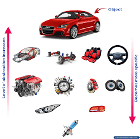

# Ejercicio Automóvil 3.0:
Desarrolla un software que modele un automovil con el fin de permitir realizar un inventario en un consesionario. Te piden tener en cuenta los siguientes elementos del automovil:
- Puestos: Número de puestos, material ("Cuero", "Vinilcuero" y "tela").
- Sonido: Número de parlantes, potencia parlantes (100, 200, y 300 vatios) Máximo 6 objetos de tipo Sonido en el automovil.
- Motor: serie (String), cilindraje (int), número de valvulas ( 8 y 16).

El automovil debe tener marca, color, modelo, año y precio.


## Actividades a desarrollar:
1. Desarrolla el UML.
2. Ahora reemplaza los arreglos por listas en el UML.
3. Implementa el código.
4. Crea un método que permita imprimir todas las caracteristicas del automovil.

## Código de prueba
Crea un método main, ahora desarrolla una lógica de prueba tal que
tengas un automovil con todos sus elementos (Puestos, Sonido, Motor) cumpliendo condiciones de composición. Finalmente imprime las caracteristicas del automovil.

## Salida de impresion
```
Automovil Nissan Sentra 2016, $26000000:
4 puestos en tela
4 parlantes de 100 [W]
Motor serie 4920142WD cilindraje 1600, 16 V
```