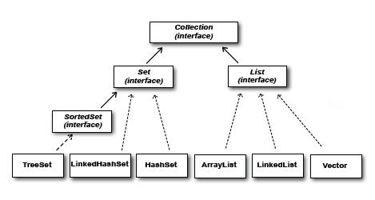
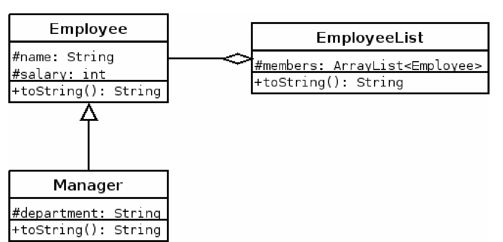

# Listas:

## Un arreglo (No lista) que guarda Strings.

```
String[] array = new String[3];
```
## Ejemplo de lista que guarda Strings.
```
ArrayList<String> lista = new ArrayList<>();
```

Las listas son clases hechas para guardar elementos, muy similar a los arreglos. Java implemento un conjunto de clases en el paquete collections. Veamos la jerarquia de clases e interfaces que implementan las listas:



Como hemos visto siempre las clases concretas son las que están en en nivel más bajo de jerarquia. Por lo tanto, las listas se crean de la siguiente forma:

```
ArrayList<Perro> perros = new ArrayList<Perro>();
```

¿Pero que cosa tan extraña son esos simbolos < > ? </br>
Resulta que el tipo de la variable dogs es ArrayList, sin embargo, debemos indicar que elementos va a contener, en este caso, solo guarda objetos de tipo perro. Los simbolos y la forma de dar el tipo de elementos a guardar se llaman GENERICOS.
Ahora apliquemos un poco de polimorfismo:
```
List<Perro> perros = new ArrayList<Perro>();
```
Como ArrayList implementa la interfaz List, podemos hacer este cambio dandole un tipo diferente al arreglo. (Igualmente es una lista)
</br>
Ahora en adelante cuando usemos listas se agrega el tipo y el generico (tipo<generico>)

```
public List<Animal> getAnimales(){
    List<Animal> animales = new ArrayList<>();
    animales.add(new Perro());
    animales.add(new Gato());
    animales.add(new Hipopotamo());
    return animales;
}
```
Fijemonos que la forma de agregar elementos es diferente. para acceder a un elemento como en los arreglos hay que usar el metodo get(i), donde i es el indice del elemento que queremos traer, finalemente, el tamaño de la lista se extrae con el metodo size().

## UML:
En UML las listas se ven de la siguiente manera:

Ya hemos visto el UML con relaciones de agregacion y composicion, en colecciones, cuando hay este tipo de relaciones se puede considerar que existe una clase contenedora y otra contenida.
La clase contenedora es la que tiene el atributo que guarda otros objetos, este atributo es una colección.

