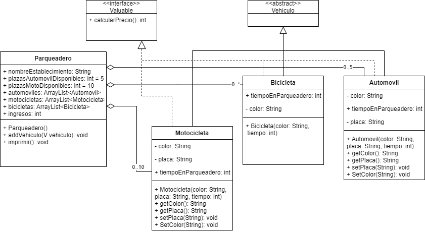
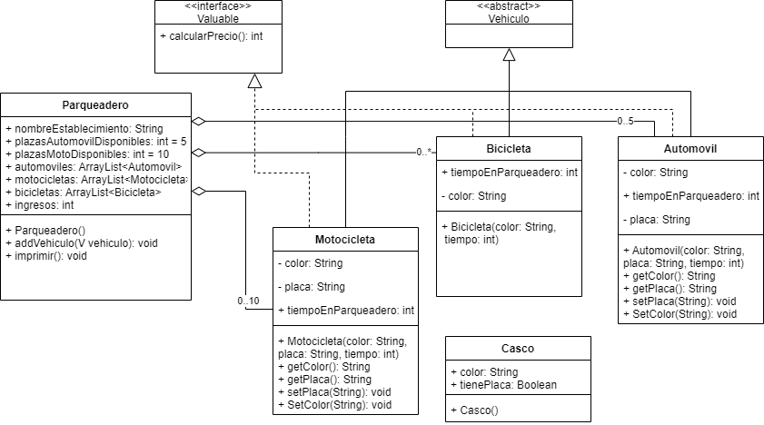

# Ejercicio parqueadero:
Se requiere desarrollar un software para un parqueadero, el UML representa el proyecto que se requiere implementar. Los vehiculos tienen el siguiente valor en el parqueadero:
- Automovil $4000 hora
- Moto $2000 hora
- Bicicleta $0
El parqueadero tiene el metodo addVehiculo, esté metodo tiene como entrada un vehiculo, el cual usa su método calcularPrecio() para agregar el precio ingresos, a su vez el método calcularPrecio() usa el atributo tiempoEnParqueadero y una variable local con el precio por hora para calcular el precio del parqueadero.
Tenga en cuenta que, el metodo addVehiculo tambien agrega el vehiculo a alguna de las listas según su capacidad máxima (longitud de la lista dada por cardinalidad).



## Actividades a desarrollar

1. Segun el UML, arregle la clase abstracta para evitar redundancias en código.
2. Desarrolle el ejercicio segun el enunciado y use el codigo prueba.


## Código de prueba

```
   public static void main(String[] args) {
       Parqueadero p = new Parqueadero();
       p.nombreEstablecimiento = "MiParking";
       addVehiculo(new Motocicleta("azul","zzz-10z",2));
       addVehiculo(new Motocicleta("verde","aaa-10z",1));
       addVehiculo(new Motocicleta("azul","ccc-10z",1));
       addVehiculo(new Motocicleta("azul","sss-10z",1));
       addVehiculo(new Motocicleta("azul","jjj-11z",2));
       addVehiculo(new Bicicleta("gris",4));
       addVehiculo(new Bicicleta("negra",2));
       addVehiculo(new Automovil("rojo",6));
       addVehiculo(new Automovil("celeste","lll-106",8));
       addVehiculo(new Automovil("negro","ooo-117",10));
       p.imprimir();
  }
```

## Impresion

```
Parqueadero "MiParking", ingresos registrados $68000, vehiculos:
Motos ["zzz-10z","aaa-10z","ccc-10z", "sss-10z", "jjj-11z"]
Bicicletas ["gris", "negra"]
Automoviles ["yyy-106", "lll-106", "ooo-117"]
```

## Extra
3. El parqueadero cobra por casco guardado, segun el nuevo UML donde deberia ir la nueva clase Casco. Verifique si necesita mas atributos o metodos para tener en cuenta el valor de cada casco guardado. Finalmente ejecute el nuevo codigo de prueba.



```
   public static void main(String[] args) {
       Parqueadero p = new Parqueadero();
       p.nombreEstablecimiento = "MiParking";
       addVehiculo(new Motocicleta("azul","zzz-10z",2,{new Casco()}));
       addVehiculo(new Motocicleta("verde","aaa-10z",1,{new Casco()}));
       addVehiculo(new Motocicleta("azul","ccc-10z",1,{new Casco(),new Casco()}));
       addVehiculo(new Motocicleta("azul","sss-10z",1,{new Casco(),new Casco()}));
       addVehiculo(new Motocicleta("azul","jjj-11z",2,{new Casco(),new Casco()}));
       addVehiculo(new Bicicleta("gris",4));
       addVehiculo(new Bicicleta("negra",2,{new Casco()}));
       addVehiculo(new Automovil("rojo",6));
       addVehiculo(new Automovil("celeste","lll-106",8));
       addVehiculo(new Automovil("negro","ooo-117",10));
       p.imprimir();
  }
```

