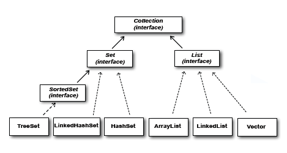

# Conjuntos:


## Ejemplo de conjunto que guarda Strings.
```
HashSet<String> conjunto = new HashSet<>();
```

Veamos la jerarquia de clases e interfaces que implementan los conjuntos:



Todos los conjuntos implementan la interface Set. ¿En que se diferencian de las listas?. Los conjuntos no guardan elementos duplicados. Es decir, si agregamos elementos al conjunto creado al principio:

```
conjunto.add("Juana");
conjunto.add("Lola");
conjunto.add("Juana");
```

y luego imprimimos el conjunto:

```
System.out.println(conjunto);
```

Encontramos la siguiente salida:

```
[Juana, Lola]
```

Aquí, corroboramos que los conjuntos no guardan duplicados, pero que tal si en vez de guardar Strings guardamos objetos de tipo Usuario (donde usuario tenga nombre y edad como atributos). Tendriamos lo siguiente:
```
    public static void main(String[] args){
        HashSet<Usuario> conjunto = new HashSet<>();
        conjunto.add(new Usuario("111","Juana",24));
        conjunto.add(new Usuario("222","lola",27));
        conjunto.add(new Usuario("111","Juana",24));
        System.out.println(conjunto);
    }
```
```
public class Usuario{
    String cedula;
    String nombre;
    int edad;

    public Usuario(String cedula, String nombre, int edad) {
        this.cedula = cedula;
        this.nombre = nombre;
        this.edad = edad;
    }
}
```
Se imprime una lista con varios objetos asi (depende del paquete donde guardaste la clase Usuario):
```
[com.ingcarlos.practica.Usuario@7852e922, com.ingcarlos.practica.Usuario@15db9742, com.ingcarlos.practica.Usuario@6d06d69c]
```
Sobreescribimos el método toString y nuestra clase Usuario queda asi:
```
public class Usuario{
    String cedula;
    String nombre;
    int edad;

    public Usuario(String cedula, String nombre, int edad) {
        this.cedula = cedula;
        this.nombre = nombre;
        this.edad = edad;
    }

    @Override
    public String toString() {
        return "Usuario{" + "cedula=" + cedula + ", nombre=" + nombre + ", edad=" + edad + '}';
    }

}
```
Ahora el resultado de impresión es el siguiente:
```
[Usuario{cedula=111, nombre=Juana, edad=24}, Usuario{cedula=111, nombre=Juana, edad=24}, Usuario{cedula=222, nombre=lola, edad=27}]
```
Tenemos dos objetos con la misma cedula, nombre y edad pero, ¿porque siguen apareciendo duplicados?. Cada vez que creamos un objeto usando la palabra reservada new, Java crea un objeto nuevo y lo guarda en memoria, por lo tanto creó dos objetos diferentes con mismos atributos.
</br>
Para hacer cambiar la forma en que Java ve iguales los objetos debemos sobreescribir dos metodos que se heredan de la clase Object (de donde viene el método toString()), los métodos son: equals() y hashCode().

```
public class Usuario{
    String cedula;
    String nombre;
    int edad;

    public Usuario(String cedula, String nombre, int edad) {
        this.cedula = cedula;
        this.nombre = nombre;
        this.edad = edad;
    }

    @Override
    public String toString() {
        return "Usuario{" + "cedula=" + cedula + ", nombre=" + nombre + ", edad=" + edad + '}';
    }


    @Override
    public int hashCode() {
       
    }

    @Override
    public boolean equals(Object obj) {
    
    }
}
```
Ahora, ¿que deberiamos colocar en los metodos equals y hashcode?, empezando por el método hashcode, hagamos de cuenta que es un numero identificador unico para cada objeto creado. En este caso queremos que si los objetos tienen la misma cédula, entonces se consideren iguales. </br>
Todas las clases String y envoltorias (Integer, Character, Float, Double, etc) implementan hashCode tal que si comparamos numeros o strings que son iguales la condicion va retornar un true (es decir, si son iguales). Solo hagamos uso del hashCode de la clase String:

```
public class Usuario{
    String cedula;
    String nombre;
    int edad;

    public Usuario(String cedula, String nombre, int edad) {
        this.cedula = cedula;
        this.nombre = nombre;
        this.edad = edad;
    }

    @Override
    public String toString() {
        return "Usuario{" + "cedula=" + cedula + ", nombre=" + nombre + ", edad=" + edad + '}';
    }


    @Override
    public int hashCode() {
       return cedula.hashCode();
    }

    @Override
    public boolean equals(Object obj) {
    
    }
}
```
Fácil, ahora, el método equals ya lo hemos usado para comparar strings, sin embargo, es un método que existe en todos los objetos. Entonces:
```
@Override
    public boolean equals(Object obj) {
        if (obj == null || getClass() != obj.getClass()) {
            return false;
        }
        final Usuario other = (Usuario) obj;
        return cedula.equals(other.cedula);
    }
```
Primero comparamos los objetos para asegurarnos que estamos comparando un usuario con un usuario, luego hacemos un casting para convertir un Object en un Usuario y finalmente hacemos uso del metodo equals de la cedula para compararlo con el objeto entrante, asi el resultado de la impresión ahora es: 
```
[Usuario{cedula=111, nombre=Juana, edad=24}, Usuario{cedula=222, nombre=lola, edad=27}]
```
## Forma corta:
En NetBeans podemos usar la opcion insert code dando click derecho al archivo, luego le damos click en hashCode() and equals(), y finalmente marcamos los atributos para indicar que los objetos creados son iguales por los valores de esos atributos.