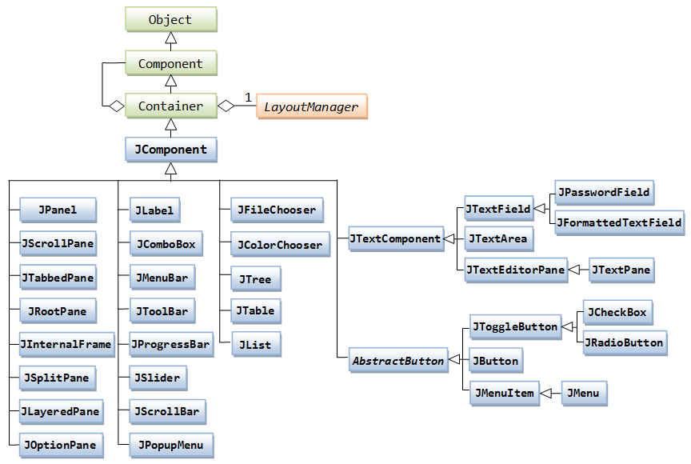
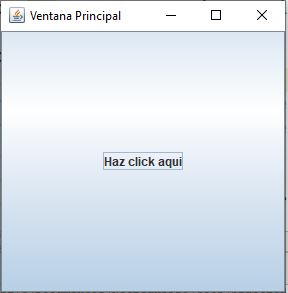

# Swing - Introducción
Java es el lenguaje perfecto para programar software de escritorio. El paradigma POO y la implementación multiplataforma permite desarrollar software robusto y altamente escalable.
Java Swing es una extension de clases que permite desarrollar interfaces graficas.



## JFrame

Los JFrame es lo primero que vemos al abrir un programa, esa ventana que se puede cerrar, maximizar o minimizar. Entonces, su unico fin, es el de guardar otros componentes de Swing, tales como botones, etiquetas, entradas. Un JFrame se crea y visualiza de la siguiente manera:

```
public static void main(String[] args){
    JFrame ventana = new JFrame("Titulo de mi ventana");
    ventana.setSize(300,300);
    ventana.setVisible(true);
    ventana.setDefaultCloseOperation(JFrame.EXIT_ON_CLOSE);
}
```

Esto es una simple ventana sin contenido, sin embargo hay que indicar el tamaño de la ventana, hay que hacerla visible y finalmente hay que indicar que la ejecución del programa termina cuando se cierra la ventana.

## Controles
### JButton

Los botones son algo muy comun en cualquier tipo de software, en Swing los creamos haciendo una instancia de JButton.

```
public static void main(String[] args){
    JFrame ventana = new JFrame("Titulo de mi ventana");
    JButton boton = new JButton("Haz click aqui");
    ventana.add(boton);
    ventana.setSize(300,300);
    ventana.setVisible(true);
    ventana.setDefaultCloseOperation(JFrame.EXIT_ON_CLOSE);
}
```
En este caso se veria algo asi:

Donde todo el boton abarca el espacio de la ventana creada.

## Eventos
Los eventos en Java se usan para ser escuchados, en este caso todos los componentes de Java pueden generar eventos segun la interaccion del usuario. Los eventos emitidos por los componentes son de tipo ActionEvent.</br>
Para escuchar eventos (Asi sea un click del botón), es necesario que en nuestra clase implementemos una interfaz, en este caso solo vamos a hacer uso de la interfaz ActionListener.
```
public class Ventana implements ActionListener{

    public void actionPerformed(ActionEvent event){

    }

    //el resto de código ...

}
```
Acordemonos, una interfaz obliga a implementar metodos y darles un cuerpo, en este caso, nos obliga a crear un metodo actionPerformed(ActionEvent event), que nos va permitir recibir el evento y luego crear la lógica que necesitemos para responder al evento. Esta es la forma de "escuchar" lo que pasa en la ventana.
</br>
Para nuestro ejemplo, si queremos solamente imprimir un "hola" en consola debemos hacer lo siguiente,

```
public class Ventana implements ActionListener{

    public void actionPerformed(ActionEvent event){
        System.out.println("Hola");
    }

    public static void main(String[] args){
        // Creacion de ventana
        JFrame ventana = new JFrame("Titulo de mi ventana");
        // Creacion de boton
        JButton boton = new JButton("Haz click aqui");
        // Indicar al boton que vamos a escuchar sus eventos
        boton.addActionListener(this);
        // Agregar el boton a la ventana
        ventana.add(boton);

        // Configurar ventanas
        ventana.setSize(300,300);
        ventana.setVisible(true);
        ventana.setDefaultCloseOperation(JFrame.EXIT_ON_CLOSE);
    }

}
```
Siempre debemos indicar al boton que vamos a escuchar usando el método addActionListener(ActionListener l), usamos el this para indicar que una instancia de nuestra clase va ser el parametro del metodo.
