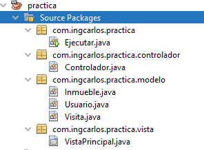

## Swing MVC:

Cada componente de Swing (Botones, Listas, Textos, etc.) Tienen asociado una Interfaz que modela los datos que se van a guardar en el componente. La interfaz Tiene una implementación que es la subclase que usamos para crear un objeto que guarde datos y se enlace con el componente. A continuacion, en la tabla se ve los componentes con sus respectivas clases Modelo.

Por lo tanto, siempre que queramos añadir datos a un componente vamos a usar instancias de las clases que empiecen por la palabra Default. Veamos un ejemplo.

Diseñamos una interfaz sencilla para consultar inmuebles creados en el sistema:
</br>

</br>
Usamos un ComboBox para seleccionar el tipo de inmueble, si verificamos la tabla anterior vemos que para el ComboBox existe una clase DefaultComboBoxModel (tiene el nombre Default) que nos va permitir guardar las opciones del ComboBox y asignarlas al componente.

Entonces, en el constructor de nuestro JFrame, que es uno de los pocos metodos que podemos modificar, vamos a crear un modelo para el ComboBox asi:

```
DefaultComboBoxModel modelo = new DefaultComboBoxModel();
modelo.addElement("Apartaestudio");
modelo.addElement("Casa en conjunto cerrado");
modelo.addElement("Oficina");
jComboBox.setModel(modelo);
```
Es así como Swing separa un componente en Modelo y Vista. El controlador de los componentes hace referencia a la lógica que realiza cada uno de los componentes cuando reciben un evento (ActionEvent). Como vimos en la introducción. Los controladores vienen siendo las clases que implementan ActionListener, porque en en esas mismas clases donde se declara la lógica de cada componente cuando la interfaz recibe un evento del usuario. Por ejemplo, la clase que se contempla a continuación es un controlador:

```
class ButtonListener1 implements ActionListener{
    @Override
    public void actionPerformed(ActionEvent e) {
        System.out.println("Has dado click");
    }
}
```
Es así como Swing separa un componente en Modelo, Vista y Controlador (MVC).

## Tablas:

Recordemos que cada componente de Swing tiene asociado una vista, el componente de vista para las tablas es un JTable. Las tablas como cualquier otro componente se crean usando una instancia de JTable. Por ejemplo, 
```
JTable tabla1 = new JTable();
```
Ahora, los datos que la tabla va mostrar se guardan en un modelo, si vamos a la tabla del principio de este documento, vemos que para un JTable existe una implementación DefaultTableModel, concordamos que es la clase que debemos usar por llevar el nombre Default. Por lo tanto, despues de crear un JTable, creamos un modelo de datos para finalmente asignarlo a la tabla.
```
Object[] columnNames = {"Cedula","Apellido","Nombres"};
Object[][] rows = {{1234,"Perez","Pepito"}, {0000,Juan,Ramirez}};        
DefaultTableModel model = new DefaultTableModel(rows, columnNames);
tabla1.setModel(model);
```
Ahora cada vez que queramos cambiar los datos de la tabla vamos a usar el modelo, veamos:
</br>
Para crear un elemento en la tabla, al igual que una coleccion usamos el método addRow() para añadir un objeto al final.

```
model.addRow(new Object[]{9999,"Carlos","Benitez"});
```

Para modificar un elemento de la tabla, es necesario indicar el indice de la fila que queremos cambiar:

```
// setValueAt(Object valor, int fila, int columna);
model.setValueAt(1111, 1, 0);
model.setValueAt("Aura", 1, 1);
model.setValueAt("Torres", 1, 2);
```
Finalmente para borrar un elemento de la tabla usamos el método removeRow(int row) del modelo que estamos cambiando.

# Organizar el proyecto en paquetes modelo, vista y controlador

Un proyecto de Swing se suele saturar debido a la cantidad de componentes, eventos y lógica que se implementa. De acuerdo a esto, para tener un proyecto limpio y facil de modificar, se separan los componentes en paquetes modelo, vista y controlador.

## Modelo

Para el modelo se crea un paquete y clases como se ve a continuación.</br>

</br>
Donde el modelo hace referencia a las clases que modelan los datos que vamos a usar, por ejemplo un sistema de información para gestión de inmuebles, en este caso la clase Inmueble va alojada en el paquete modelo. Un ejemplo simple de los atributos y métodos de la clase inmueble son:

```
public String id;
public String tipo;

public Inmueble(String id, String tipo) {
    this.id = id;
    this.tipo = tipo;
}
```

## Controlador

Las clases controlador son las mas importantes y criticas para la implementación de la lógica del negocio. En este caso el controlador es la única clase que hace uso de la vista como de los modelos, es decir, es el punto medio. Los controladores tienen 3 elementos fundamentales (como todas las clases): atributos, métodos y clases embebidas. Un ejemplo de los atributos del controlador son los siguientes:

```
public VistaPrincipal vista;
public List<Inmueble> inmuebles;
```

Un ejemplo de las clases embebidas son:

```
class BtnListener implements ActionListener {
    @Override
    public void actionPerformed(ActionEvent e) {
        System.out.println("Se hizo click en el boton");
    }
}
```
Acordemonos que para escuchar eventos de un componente es necesario tener dos cosas:
- Una clase que escucha (que implementa ActionListener)
- Una instancia de la clase que escucha en el boton (Ver más adelante el método constructor)

y finalmente un ejemplo de los métodos en un controlador son:

```
public void initComboData(){
    DefaultComboBoxModel<String> modelo = new DefaultComboBoxModel<>();
    modelo.addElement("Apartamento");
    modelo.addElement("Casa");
    this.vista.getCombo().setModel(modelo);
}
```

```
public void initTabla(){
    Object[] columnNames = {"ID Inmueble","Tipo Inmueble"};    
    DefaultTableModel model = new DefaultTableModel(columnNames, 0);
    
    for (Inmueble inmueble : inmuebles) {
        model.addRow(new Object[]{inmueble.id,inmueble.tipo});
    }
    
    vista.getjTable1().setModel(model);
}
```

```
public void initInmuebles(){
    inmuebles = new ArrayList<>();
    inmuebles.add(new Inmueble("123","Apartamento"));
    inmuebles.add(new Inmueble("000","Casa"));
}
```
Acá se incluye el constructor:
```
public Controlador(VistaPrincipal vista) {
    this.vista = vista;
    this.vista.getBtn().addActionListener(new BtnListener());
    initComboData();
    initInmuebles();
    initTabla();
}
```
Como se contempla en los métodos, es necesario que los componentes que se usen como tablas, botones, etc. sean publicos o tengan un getter.

## Vista
La vista es el JFrame que usamos en NetBeans para arrastrar y soltar los elementos que necesitamos en la ventana. sin embargo, es acá donde vemos que los atributos de la vista son los mismos componentes, por defecto se crean privados, por ende, para usarlos en otra clase (como el controlador), es necesario asignarles modificador de acceso publico o crearles para cada uno un getter.
Por ejemplo, un boton pasa de ser esto:
```
private javax.swing.JButton btn;
```
a esto:
```
public javax.swing.JButton btn;
```
O mejor, dejamos el modificador de acceso private para crear: 
```
public JButton getBtn() {
    return btn;
}
```

Finalmente, como hemos acostumbrado, dejamos el método main en una clase aparte (Que se llame Ejecutar, Run, Correr, o como queramos).
```
public static void main(String args[]) {

    /* Create and display the form */
    java.awt.EventQueue.invokeLater(new Runnable() {
        
        public void run() {
            VistaPrincipal vista = new VistaPrincipal();
            Controlador controlador = new Controlador(vista);
            vista.setVisible(true);
        }
        
    });
}
```
Para conectar la vista con el controlador, es necesario crear instancias y luego asignar la vista al controlador por medio del constructor. (Como se ve en el código anterior)