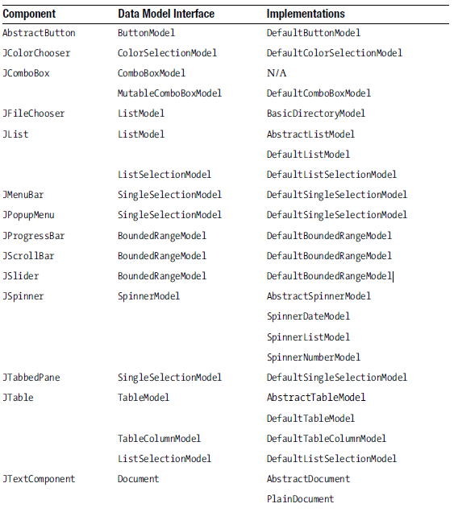
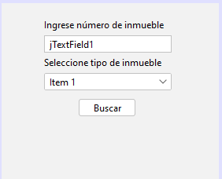

## Swing MVC:

Cada componente de Swing (Botones, Listas, Textos, etc.) Tienen asociado una Interfaz que modela los datos que se van a guardar en el componente. La interfaz Tiene una implementación que es la subclase que usamos para crear un objeto que guarde datos y se enlace con el componente. A continuacion, en la tabla se ve los componentes con sus respectivas clases Modelo.

Por lo tanto, siempre que queramos añadir datos a un componente vamos a usar instancias de las clases que empiecen por la palabra Default. Veamos un ejemplo.

Diseñamos una interfaz sencilla para consultar inmuebles creados en el sistema:


Usamos un ComboBox para seleccionar el tipo de inmueble, si verificamos la tabla anterior vemos que para el ComboBox existe una clase DefaultComboBoxModel (tiene el nombre Default) que nos va permitir guardar las opciones del ComboBox y asignarlas al componente.

Entonces, en el constructor de nuestro JFrame, que es uno de los pocos metodos que podemos modificar, vamos a crear un modelo para el ComboBox asi:

```
DefaultComboBoxModel modelo = new DefaultComboBoxModel();
modelo.addElement("Apartaestudio");
modelo.addElement("Casa en conjunto cerrado");
modelo.addElement("Oficina");
jComboBox.setModel(modelo);
```
Es así como Swing separa un componente en Modelo y Vista. El controlador de los componentes hace referencia a la lógica que realiza cada uno de los componentes cuando reciben un evento (ActionEvent). Como vimos en la introducción. Los controladores vienen siendo las clases que implementan ActionListener, porque en en esas mismas clases donde se declara la lógica de cada componente cuando la interfaz recibe un evento del usuario. Por ejemplo, la clase que se contempla a continuación es un controlador:

```
class ButtonListener1 implements ActionListener{
    @Override
    public void actionPerformed(ActionEvent e) {
        System.out.println("Has dado click");
    }
}
```
Es así como Swing separa un componente en Modelo, Vista y Controlador (MVC).

