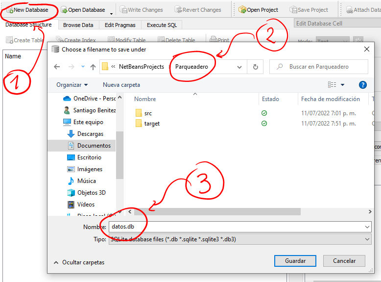
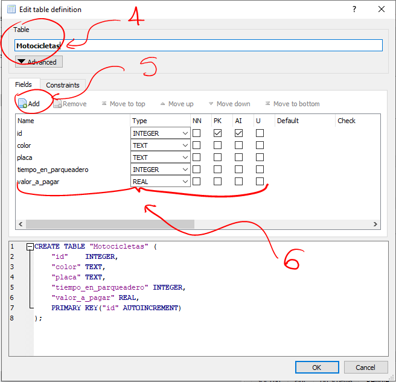
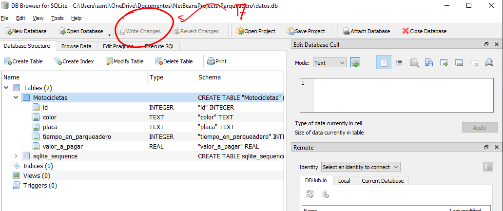
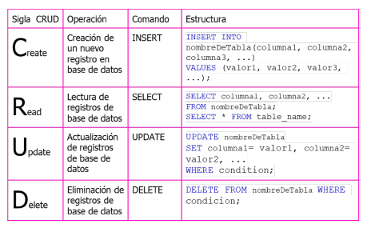

# Bases de datos
Una base de datos es cualquier elemento que contenga información, por ejemplo, una libreta de contactos, un excel, etc. Sin embargo, se dice que la información (o los datos) toman un papel fundamental en una empresa o entidad, además, son invaluables.
Debido a la importancia de las bases de datos se constituyeron varias tecnologías que den soporte al almacenamiento de información digital, en este caso, las tecnologias se dividen en dos tipos, bases de datos relacionales y no relacionales.

## Bases de datos relacionales, SQL
Son gestores y administradores de bases de datos relacionales que implementan un lenguaje en común, SQL. SQL permite estructurar y operar bases de datos que se componen de tablas, a su vez, las tablas de las bases de datos se pueden relacionar (A esto se debe el nombre de bases de datos relacionales).

## SQLite
SQLite permite gestionar y realizar transacciones de bases de datos en un archivo local (generalmente con extension .db o .sqlite3). Todas las bases de datos se pueden gestionar mediante consola de comandos,. Sin embargo, al ser una tarea tediosa cuando se trata con muchas tablas, se suelen usar administradores de bases de datos. En el caso de SQLite existen programas como DBeaver, DbVisualizer y [DB Browser For SQLite](https://sqlitebrowser.org/).
</br>
Para el contenido de este curso vamos a usar DB Browser. Ahora, ¿Cómo creamos una base de datos?. Veamos el siguiente tutorial.
&nbsp;

1. En DB Browser dar click en New Database
2. Buscar una carpeta para guardar la base de datos, preferiblemente en la raíz de un proyecto de NetBeans junto a la carpeta src y target
3. Asignar un nombre y extensión a la base de datos

&nbsp;&nbsp;

&nbsp;&nbsp;

Automaticamente aparecera la ventana para crear una tabla.

4. Se asigna un nombre a la tabla (en plural)
5. Al dar click en add, se agrega una nueva columna a la tabla.
6. Asignar nombre de columna (siempre en minuscula), tipo de variables a guardar en la columna, indicar si es obligatorio (check NN), indicar una sola llave primaria (recomendable que sea autoincrementable) y finalmente indicar si ese valor deberia ser unico (check U)

&nbsp;&nbsp;

&nbsp;&nbsp;

7. Finalmente, damos click en write changes para guardar los cambios en nuestra base de datos.

&nbsp;&nbsp;


## Conexiones Java - SQLite
Para usar SQLite o cualquier base de datos en Java, es necesario importar dependencias en nuestro proyecto, para ello nos dirigimos al [repositorio de dependencias Maven](https://mvnrepository.com/), ahora buscamos SQLite, damos click al repositorio que concuerde con SQLite JDBC, y seleccionamos una versión (Que sea más actual y tenga más usos), en este caso la versión 3.36.0.3, allí podemos copiar las etiquetas dependency con el fin de pegarlas en el archivo que esta dentro de Project Files (pom.xml). Un ejemplo de un pom con la dependencia seria:

```
<?xml version="1.0" encoding="UTF-8"?>
<project xmlns="http://maven.apache.org/POM/4.0.0" xmlns:xsi="http://www.w3.org/2001/XMLSchema-instance" xsi:schemaLocation="http://maven.apache.org/POM/4.0.0 http://maven.apache.org/xsd/maven-4.0.0.xsd">
    <modelVersion>4.0.0</modelVersion>
    <groupId>com.ingcarlos.parqueadero</groupId>
    <artifactId>Parqueadero</artifactId>
    <version>1.0-SNAPSHOT</version>
    <properties>
        <project.build.sourceEncoding>UTF-8</project.build.sourceEncoding>
        <maven.compiler.source>1.8</maven.compiler.source>
        <maven.compiler.target>1.8</maven.compiler.target>
        <exec.mainClass>com.ingcarlos.parqueadero.Parqueadero</exec.mainClass>
    </properties>
    
    <!-- Creamos una etiqueta dependiencies para guardar lo que queramos importar -->
    <dependencies>
        <dependency>
            <groupId>org.xerial</groupId>
            <artifactId>sqlite-jdbc</artifactId>
            <version>3.36.0.3</version>
        </dependency>
    </dependencies>
    
</project>
```

## SQL
Para el ciclo 2, vamos a usar el lenguaje de manejo DML. En la siguiente imagen se refleja las operaciones a usar. 

</br>



Las sentencias son una estructura de codigo que permiten realizar una operacion sobre la base de datos, en este caso hacemos referencia a la ultima columna de la tabla anterior. Un resumen de las sentencias y su uso se puede ver en [w3schools](https://www.w3schools.com/sql/).

### Clase Conexion

Ahora, creamos una clase que permita conectar a la base de datos y permita realizar operaciones CRUD (Create, Read, Update y Delete). Empecemos con los atributos de la clase:

- url, indica el tipo de driver (sqlite) y la ubicacion de la base de datos
- conexion, es un objeto que permite conectar con la base de datos haciendo uso de sus métodos
- sentencia, es un objeto que permite ejecutar sentencias de SQL como String para realizar una transacción con la base de datos. Necesita que primero se haya hecho la conexion.
- resultadosConsulta, despues de usar el objeto sentencia, se usa para recuperar los resultados de una consulta en la base de datos.

```
private String url = "jdbc:sqlite:datos.db";
public Connection conexion;
private Statement sentencia;
private ResultSet resultadosConsulta;
```

Ahora revisemos el método constructor (para una clase que en este caso se llama ConexionDB). Siempre que trabajemos con bases de datos existen errores que no se pueden manejar, en estos casos, para responder a un posible error se utiliza el *try catch*, en pocas palabras, se trata de intentar ejecutar un bloque de código, si algo sale mal (por ejemplo, no colocamos bien la url de la base de datos), entonces inmediatamente se ejecuta el catch, donde podemos manejar el error a nuestro antojo (en este caso solo se imprime el error).

```
public ConexionDB() {
    try {
        conexion = DriverManager.getConnection(url);
        DatabaseMetaData meta = conexion.getMetaData();
        System.out.println("Base de datos conectada! \n" + meta.getDriverName());
    } catch (SQLException e) {
        System.err.println(e.getMessage());
    }
}
```
### Cerrar conexion:
Se crea un método para cerrar la conexion. Este método usa el atributo conexion para cerrar el enlace con la base de datos.

```
public void cerrarConexion() {
    if (conexion != null) {
        try {
           conexion.close();
           System.err.println("Se cerro la conexion con la base de datos!");
        } catch (SQLException e) {
            System.err.println(e.getMessage());
        }
    }
}
```

### CRUD: Create

Si nos fijamos todas las operaciones CRUD deben ir en métodos, por esta razon, para INSERTAR un registro en una tabla se usa un método como el siguiente.

```
public boolean crear(String textoSentencia) {
    try {
        sentencia = conexion.createStatement();
        sentencia.execute(textoSentencia);
        return true;
    } catch (SQLException e) {
        System.err.println(e.getMessage());
        return false;
    }
}
```

### CRUD: Read

Para consultar registros en una base de datos se usa el siguiente método.

```
public ResultSet consultar(String textoSentencia) {
    try {
        sentencia = conexion.createStatement();
        resultadosConsulta = sentencia.executeQuery(textoSentencia);
    } catch (SQLException e) {
        System.out.println(e.getMessage());
    }
    return resultadosConsulta;
}
```

### CRUD: Update

Para actualizar un registro en una base de datos se usa el siguiente método.

```
public boolean actualizar(String textoSentencia) {
    try {
        sentencia = conexion.createStatement();
        sentencia.executeUpdate(textoSentencia);
        return true;
    } catch (SQLException e) {
        System.out.println(e.getMessage());
        return false;
    } 
}
```

### CRUD: Delete

Para eliminar un registro en una base de datos se usa el siguiente método.

```
public boolean borrar(String textoSentencia) {
    try {
        sentencia = conexion.createStatement();
        sentencia.execute(textoSentencia);
        return true;
    } catch (SQLException e) {
        System.err.println(e.getMessage());
        return false;
    }
}
```

### Commit y Rollback
En las transacciones a bases de datos existen estos dos conceptos. Los commit se usan para confirmar una transacción (Ejemplo, agregar un registro) y los Rollback se usan para descartar una transacción (Ejemplo, descargar la eliminación de un registro). Por defecto el uso de la conexion realiza el autoCommit, es decir, cada operación que se realice no tiene vuelta atrás.


## Como usar la clase Conexion para persistir los datos
Se crea otra clase que modele un objeto (que usemos para nuestro proyecto),
por ejemplo, la clase Producto tiene:
```
public int id;
public String nombre;
public int cantidad;
public int precio;
public String categoria;
private ConexionDB conexion = new ConexionDB();
public Producto(int id, String nombre, int cantidad, int precio, String categoria) {
    this.id = id;
    this.nombre = nombre;
    this.cantidad = cantidad;
    this.precio = precio;
    this.categoria = categoria;
}
public Producto(String nombre, int cantidad, int precio, String categoria) {
    this.nombre = nombre;
    this.cantidad = cantidad;
    this.precio = precio;
    this.categoria = categoria;
}
public Producto() {
}
```

### ReadOne
Para leer un solo registro de la tabla creamos el siguiente metodo en la clase Producto. Donde la variable sql contiene el texto que representa una sentencia en SQL (en este caso una consulta)

```
public Producto getOne(int id) {
    ConexionDB conexion = new ConexionDB();
    String sql = "SELECT * FROM productos WHERE id=" + id+ ";";
    ResultSet rs = conexion.consultar(sql);
    try {
        if (rs.next()) {
            id = rs.getInt("id");
            color = rs.getString("nombre");
            cantidad = rs.getInt("cantidad");
            precio = rs.getInt("precio");
            categoria = rs.getString("categoria");
            conexion.cerrarConexion();
        } else {
            conexion.cerrarConexion();
            return null;
        }
    } catch (SQLException e) {
        System.err.println(e.getMessage());
    }
    return this;
}
```

### ReadAll
Para listar todos los elementos de la tabla se reemplaza el if por un while, ademas se crea una lista vacia para que a medida que se recupere cada celda de la tabla se creen las instancias para guardarlas en la lista. El método next() pasa el siguiente elemento de la variable rs (Usando los ResultSet no es posible obtener una fila completa usando un indice, mientras que con las listas se usa el método get(i) para obtener el i-esimo elemento)

```
public List<Producto> getProductos() {
    List<Producto> lista = new ArrayList<>();
    String sql = "SELECT * FROM productos;";
    try {
        ResultSet rs = conexion.consultar(sql);
        while (rs.next()) {
            lista.add(new Producto(rs.getInt("id"), rs.getString("nombre"),
                    rs.getInt("cantidad"), rs.getInt("precio"), rs.getStrin("categoria")));
        }
    } catch (SQLException e) {
        System.out.println(e.getMessage());
    }
    conexion.cerrarConexion();
    return lista;
}
```

### Update
El método update usa los atributos del objeto para armar la sentecia SQL y ejecutarla usando el metodo de la clase Conexion.

```
public void update() {
    String sql = "UPDATE productos\n"
            + "SET nombre = '" + nombre + "', cantidad = " + cantidad
            + ", precio = " + precio + ", categoria= '" + categoria + "'\n"
            + "WHERE id = "+id+";";
    conexion.actualizar(sql);
    conexion.cerrarConexion();
}
```

### Insert
Al igual que update, se usan los atributos del objeto para armar la sentencia SQL a ejecutar.

```
public void save() {
    String sql = "INSERT INTO productos(nombre, cantidad, precio, categoria)\n"
            + "VALUES ('" + nombre + "', " + cantidad + ", " + precio + ", '" +categoria + "');";
    conexion.crear(sql);
    conexion.cerrarConexion();
}
```

### Delete
Eliminar solo necesita el id (PK, llave primaria) para borrar un elemento en la tabla. Se puede eliminar usando cualquier otro campo. (Ejemplo, "DELETE FROM productos WHERE nombre="+nombre+";")

```
public void delete(){
    String sql = "DELETE FROM productos WHERE id="+id+";";
    conexion.borrar(sql);
    conexion.cerrarConexion();
}
```